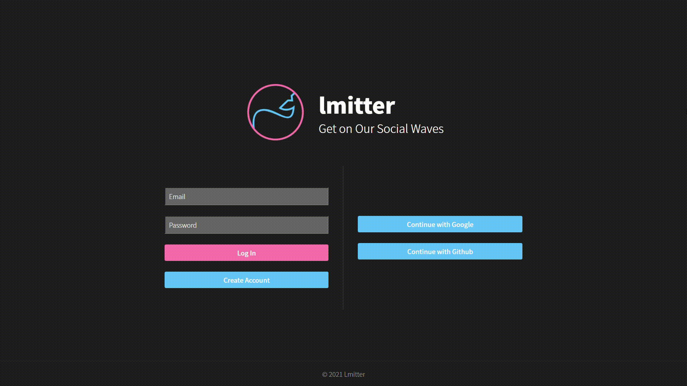

# lmitter

## To realize baisc Social Media platform

*quick view*

## link
    https://hellolimi.github.io/lmitter/#/

## Fundamental Works

- using React.js to realize Single Page Application
- using Firebase to set up database in the app
- using SCSS to add style in the app

## Notable Functions

- to join the application with name, email and password
- to show error message to users when they fill the join form incorrectly
- to sign in with the joined account or Google/GitHub provider
- to deliver user data & refresh-user fucntion to other components using Context API
- to create 'lmittes' - text & image contents in the platform
- to edit my 'lmittes'
- to delete my 'lmittes'
- to press like button for each 'lmitte' and show the counts of the likes
- to leave a comment for each 'lmitte'
- to change 'profile status' in my profile page
- to visit other people's profile pages
- to check 'lmittes' from each user in their own profile page
- to create 'loading spinner' component using 'useEffect' hooks
- to log out and return to root path using 'useHistory' from 'react-router'
